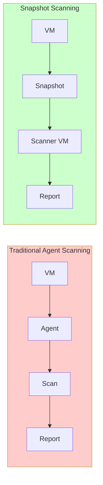
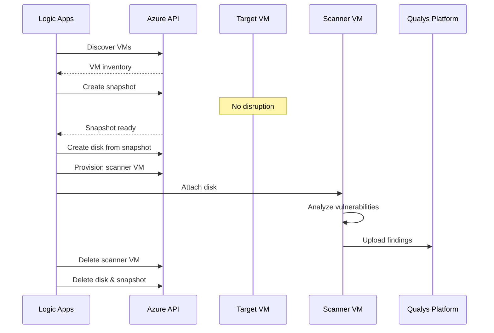
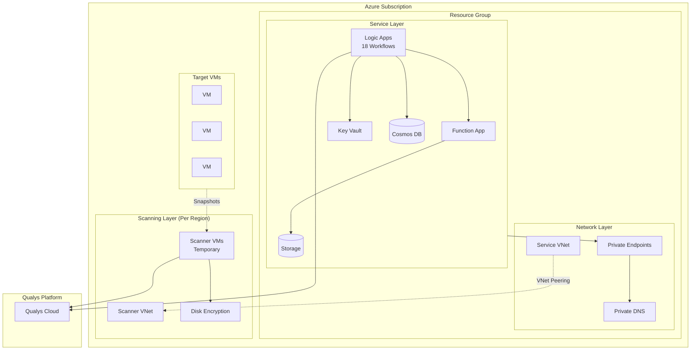
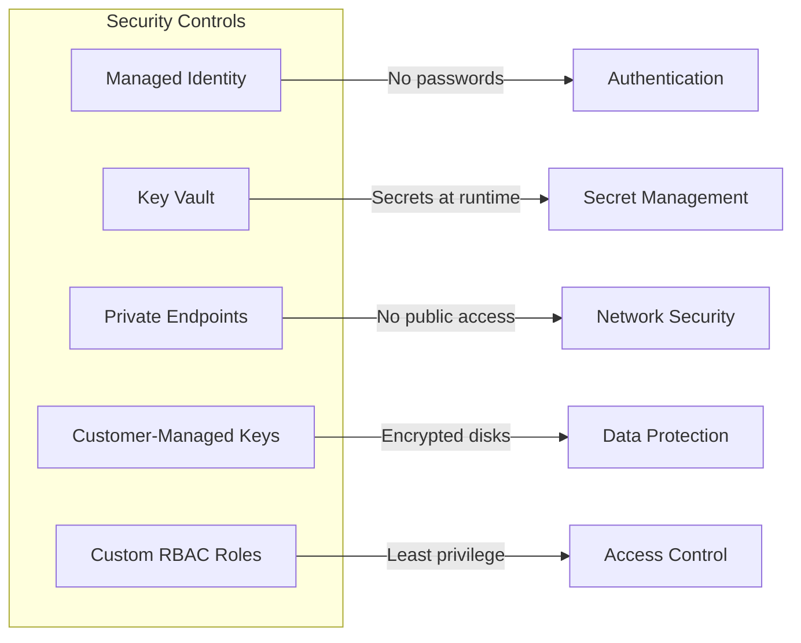
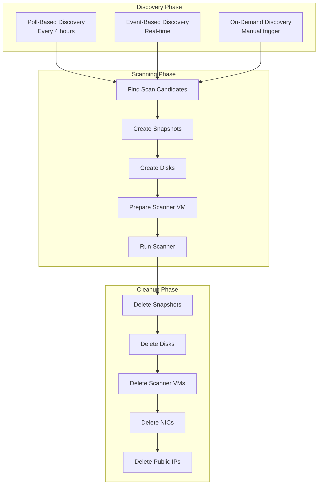
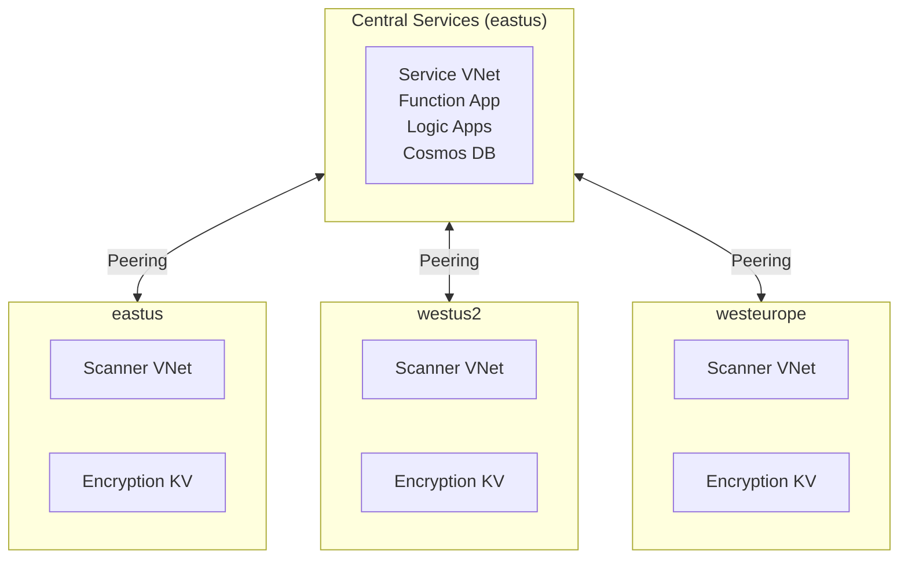

# Agentless Vulnerability Scanning for Azure VMs: A Zero-Footprint Approach

## The Challenge with Traditional Agent-Based Scanning

Traditional vulnerability management relies on deploying agents to every virtual machine in your environment. While effective, this approach introduces significant operational challenges:

- **Deployment overhead** - Installing and maintaining agents across hundreds or thousands of VMs
- **Resource consumption** - Agents consume CPU, memory, and network bandwidth on production workloads
- **Coverage gaps** - VMs that can't run agents (locked-down images, legacy systems) remain unscanned
- **Credential management** - Agents require service accounts and authentication mechanisms
- **Patching complexity** - Agents themselves need updates and maintenance

For organizations running dynamic cloud workloads where VMs spin up and down frequently, maintaining agent coverage becomes a constant battle.

## A Different Approach: Snapshot-Based Scanning

What if you could scan every VM in your Azure environment without installing anything on them?

The Qualys Azure Snapshot Scanner takes a fundamentally different approach: instead of running code inside your VMs, it creates point-in-time snapshots of VM disks and analyzes them externally. This provides complete vulnerability visibility with zero footprint on your production workloads.



### How It Works

1. **Discovery** - Automated workflows discover VMs across your Azure subscriptions
2. **Snapshot** - Create read-only disk snapshots (no impact to running VMs)
3. **Analysis** - Mount snapshots to temporary scanner VMs for vulnerability assessment
4. **Reporting** - Upload findings to the Qualys platform
5. **Cleanup** - Automatically remove all temporary resources

The entire process is non-intrusive. Your production VMs continue running normally while their disk contents are analyzed offline.



## Why Agentless Matters

### Complete Coverage

Every VM with a disk can be scanned, regardless of:
- Operating system (Windows, Linux, any distribution)
- Network connectivity (isolated VNets, air-gapped environments)
- Security posture (hardened images that block agent installation)
- VM state (even stopped VMs can be scanned)

### Zero Performance Impact

Snapshots are copy-on-write operations that complete in seconds. The actual scanning happens on dedicated scanner VMs, completely isolated from your production workloads.

### Simplified Operations

No agents to deploy, update, or troubleshoot. The scanning infrastructure is fully automated and self-cleaning.

### Reduced Attack Surface

Without agents running on production VMs, there's no additional software that could be exploited or misconfigured.

## Architecture Overview

The solution deploys a complete scanning infrastructure in your Azure subscription:



### Security by Design

The infrastructure implements defense-in-depth security:

| Control | Implementation |
|---------|----------------|
| **Secrets Management** | Qualys credentials stored in Key Vault, accessed via Managed Identity |
| **Network Isolation** | Private endpoints for all data services, no public internet exposure |
| **Identity** | User-Assigned Managed Identities, no service principal keys |
| **Encryption** | Customer-managed keys for all scanner disks |
| **Access Control** | Custom RBAC roles with least-privilege permissions |



## Deployment

Deploy the complete infrastructure with a single command:

```bash
az deployment sub create \
  --location eastus \
  --template-file main.bicep \
  --parameters \
    location=eastus \
    qualysEndpoint='https://gateway.qg1.apps.qualys.com' \
    qualysSubscriptionToken='your-token' \
    targetLocations='["eastus", "westus2"]' \
    deployerObjectId=$(az ad signed-in-user show --query id -o tsv)
```

The deployment creates:

- **8 Bicep modules** orchestrating 50+ Azure resources
- **18 Logic App workflows** for discovery, scanning, and cleanup
- **Private networking** with VNet peering across regions
- **Automated scheduling** for continuous vulnerability assessment

## Workflow Automation

The solution includes purpose-built workflows for each stage of the scanning lifecycle:



## Multi-Region Support

Scan VMs across any Azure region by specifying target locations:

```bash
targetLocations='["eastus", "westus2", "westeurope", "southeastasia"]'
```

Each region gets dedicated infrastructure:
- Isolated scanner VNet
- Region-specific disk encryption Key Vault
- VNet peering to central service network



## Results Integration

Scan results flow directly to the Qualys platform where they integrate with your existing vulnerability management workflows:

- Unified dashboard across agent and agentless scans
- Consistent vulnerability severity ratings
- Integration with ticketing and remediation workflows
- Historical trending and compliance reporting

## Getting Started

### Prerequisites

- Azure subscription with Owner access
- Qualys subscription with Snapshot Scanner entitlement
- Azure CLI installed

### Quick Start

1. **Get your Qualys subscription token** from the Qualys platform
2. **Deploy the infrastructure**:
   ```bash
   az deployment sub create \
     --location eastus \
     --template-file main.bicep \
     --parameters \
       location=eastus \
       qualysEndpoint='https://gateway.qg1.apps.qualys.com' \
       qualysSubscriptionToken='your-token' \
       targetLocations='["eastus"]' \
       deployerObjectId=$(az ad signed-in-user show --query id -o tsv)
   ```
3. **Trigger the initial sync** - Run the `qualys-function-app-syncer` Logic App
4. **View results** in the Qualys platform

## Conclusion

Agentless snapshot scanning eliminates the operational burden of traditional vulnerability management while providing comprehensive coverage across your Azure environment. By analyzing disk snapshots instead of running agents, you get:

- **100% coverage** - Every VM can be scanned
- **Zero impact** - No performance overhead on production workloads
- **Simplified operations** - No agents to deploy or maintain
- **Enhanced security** - Reduced attack surface, no credentials on VMs

The Infrastructure-as-Code deployment ensures consistent, repeatable, and auditable infrastructure that aligns with enterprise security requirements.

---

*For detailed parameter reference and troubleshooting, see the [README](../README.md).*
